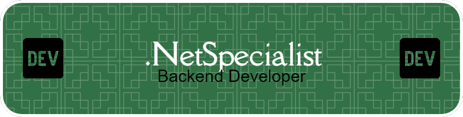

# 👋 Hello! I'm Mikael

 <!-- Replace this placeholder with a custom banner if desired -->

I'm Mikael, a passionate Back End Developer from Gothenburg, Sweden, currently studying to become a Software Developer! My main focus is on .NET development, where I create efficient, reliable, and scalable solutions tailored to meet diverse business needs. While specializing in back-end development, I’m also exploring various technology stacks, continually expanding my skill set, and always eager to learn more.

As a student, I balance my studies with hands-on projects that deepen my understanding of software architecture, coding best practices, and emerging trends in the tech industry. I’m dedicated to writing clean, maintainable, and effective code and am excited to apply these skills in real-world scenarios, both in my studies and professional projects.

Outside of my studies, I actively seek opportunities to collaborate, contribute to open-source projects, and connect with the tech community in Gothenburg. Let’s connect if you’re interested in discussing tech, brainstorming ideas, or collaborating on an innovative project!

---
 🛠️ Languages and Tools

- **Languages:**  
   

- **Frameworks & Libraries:**  
   

- **Tools & Platforms:**  
  

---

📈 GitHub Stats & Activity

---

🎉 Fun Facts

- 💻 Currently, I'm diving deep into **.NET services**.
- 🌍 Based in **Gothenburg, Sweden** – embracing the Swedish tech scene!
- 🎨 Hobbies: Besides coding, I enjoy creating digital art, gaming, and exploring the beautiful Gothenburg archipelago.

---

### 📫 Let's Connect!

- [LinkedIn](https://www.linkedin.com/in/YourLinkedIn)

---

 <!-- Replace with any other animated GIF you like -->

---

